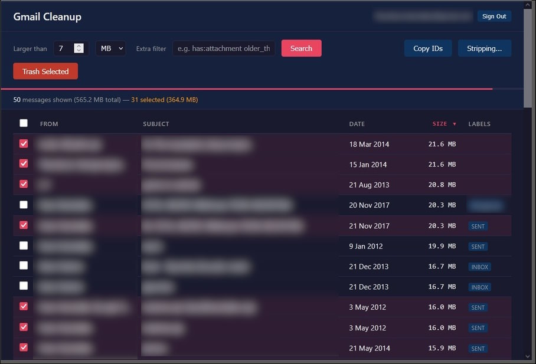
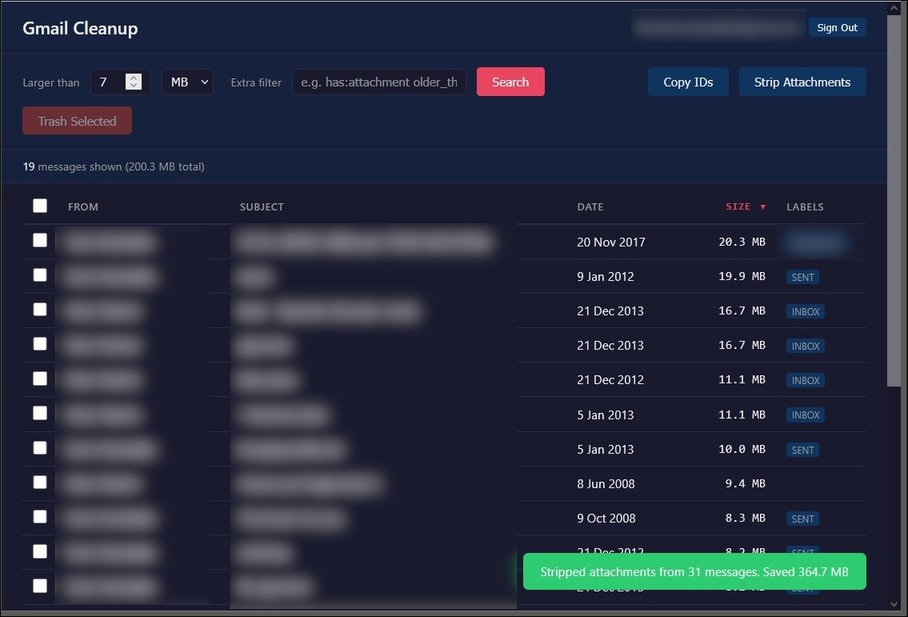

# Gmail Cleanup & Attachment Stripper

Single-file, client-side web app for cleaning up Gmail. Find large emails, preview them, trash what you don't need, strip attachments from emails you want to keep. Everything runs in your browser and no data leaves your machine.





## Features

- **Search** by size with Gmail query filters (`larger:10M`, `has:attachment`, `older_than:1y`, etc.). Auto-searches on connect.
- **Sortable results** by sender, subject, date, or size
- **Shift+click** to select a range of rows
- **Email preview** - click any subject to see the full rendered email with From, To, Date headers, a link to open in Gmail, and inline attachment previews (images, text)
- **Attachment preview** - click an attachment to preview images and text files inline, or download other types. Previewed attachment gets a highlighted border.
- **Bulk trash** - select and trash multiple emails at once
- **Selective attachment stripping** - two ways:
  - **From the preview panel**: each attachment has a checkbox. Uncheck the ones you want to keep, click "Strip Checked" to strip only the selected attachments from that email.
  - **From the toolbar**: select emails, click "Strip Attachments". A review modal shows every email with its attachments listed individually. Uncheck any attachment you want to keep across all selected emails, then confirm.
- **Safe**: originals go to Trash (recoverable for 30 days). Inline images referenced by the HTML body are preserved. Removed attachments are replaced with a text stub noting filename and size.
- **Session stats** in the header showing emails processed and space freed
- **Persistent auth** - OAuth token cached in localStorage, no re-authentication on page reload

## Setup

You need a Google Cloud project with the Gmail API enabled and OAuth credentials.

1. Go to [Google Cloud Console > APIs & Services](https://console.cloud.google.com/apis/dashboard)
2. Create a project (or use an existing one)
3. Enable the **Gmail API**
4. Go to **Credentials**, create an **OAuth 2.0 Client ID**:
   - Application type: **Web application**
   - Authorized JavaScript origins: `http://localhost:PORT` (pick any port, e.g. `http://localhost:9123`)
5. Create an **API Key** (optionally restrict it to the Gmail API)
6. Go to **OAuth consent screen** > **Audience**, add your Gmail address as a test user (required while the app is in "Testing" mode)

## Usage

The file must be served over HTTP - Google OAuth won't work from a `file://` URL. Pick any port and use it consistently with the JavaScript origin you set up above.

```bash
python -m http.server 9123
# or: npx serve -p 9123
# or: php -S localhost:9123
```

Open `http://localhost:9123` in your browser, enter your Client ID and API Key, click Connect. The app auto-searches for large emails on first connect.

### Browsing and selecting

- Set the size threshold and optionally add Gmail search filters, press Enter or click Search
- Click any row to toggle selection, or use the checkbox
- Shift+click to select a range of rows between the last clicked and current
- Click a subject to open the preview panel (Esc to close)

### Trashing emails

Select emails, click **Trash Selected**. Emails move to Gmail Trash (auto-deleted after 30 days).

### Stripping attachments

**Bulk (from toolbar):** Select emails, click **Strip Attachments**. A review modal lists every selected email with its attachments. Each attachment has a checkbox (all checked by default). Uncheck any you want to keep, then confirm. Shows total count and size of what will be stripped.

**Per-email (from preview):** Open an email preview, check/uncheck individual attachments, click **Strip Checked** at the bottom of the panel.

For each email, the stripping process:

1. Downloads the raw MIME message
2. Parses the MIME structure, identifies attachment parts
3. Keeps inline images referenced by the HTML body (`cid:` references)
4. Replaces selected attachments with a text stub: `[Attachment removed: filename.pdf, ~2.5 MB]`
5. Re-inserts the stripped email with original labels, thread, and read/unread state
6. Moves the original to Trash

## How it works

Single HTML file with inline CSS and JavaScript. Uses [Google Identity Services](https://developers.google.com/identity/gsi/web) for OAuth and [gapi](https://github.com/google/google-api-javascript-client) for Gmail API calls (`messages.list`, `messages.get`, `messages.insert`, `messages.trash`, `messages.attachments.get`). No other dependencies.

## Privacy

- Credentials stored in `localStorage` only
- API calls go directly from your browser to Google
- No telemetry, analytics, or third-party requests

## License

MIT
